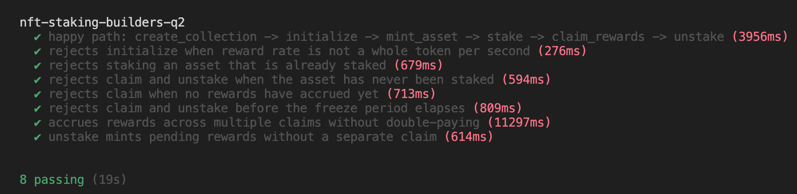

# NFT Staking Builders Q2

An Anchor program that lets owners stake Metaplex Core NFTs from a collection and earn SPL reward tokens over time. Staking state lives on each asset via MPL Core plugins; rewards are minted from a per-collection PDA-controlled mint.

**Program ID:** `EZ3oBGh31197iEowQrs7KabmnR9XogR8ZoHZMUK7Vq8J`

## Overview

The program follows a collection-scoped lifecycle:

1. **Create a collection** — A Metaplex Core collection is created with a PDA update authority and a `staked_nfts` attribute.
2. **Initialize staking** — Per collection, a `Config` PDA and a 6-decimal rewards mint are created. The admin sets the reward rate and freeze period.
3. **Mint assets** — NFTs are minted into the collection with a `FreezeDelegate` plugin (initially unfrozen).
4. **Stake** — The owner locks the NFT by freezing it and writing staking attributes (`staked`, `staked_time`, `last_claimed_at`).
5. **Claim rewards** — After the freeze period, the owner mints accrued SPL tokens without unstaking.
6. **Unstake** — The NFT is unfrozen, any pending rewards are minted automatically, and staking attributes are cleared.

## Instructions

| Instruction | Description |
|---|---|
| `create_collection` | Creates a Metaplex Core collection via CPI. Uses a PDA (`update_authority`) as the collection update authority. |
| `initialize` | Creates `Config` and `rewards_mint` PDAs for a collection. Validates that `reward_rate_per_sec` is a whole number of tokens per second. |
| `mint_asset` | Mints a Core asset into the collection with an owner-controlled `FreezeDelegate` plugin. |
| `stake` | Marks the asset as staked, records timestamps on the Attributes plugin, and freezes the NFT via `FreezeDelegate`. |
| `claim_rewards` | Mints SPL rewards accrued since the last claim (or since stake) into the owner's associated token account. |
| `unstake` | Unfreezes the NFT, mints any remaining rewards, resets `staked` to `0`, and accumulates total `staked_time`. |

## On-chain state

### `Config` PDA

Seeds: `["config", collection]`

| Field | Purpose |
|---|---|
| `reward_rate_per_sec` | Reward rate in base units (6 decimals). Must be a multiple of `1_000_000` (e.g. `1_000_000` = 1 token/sec). |
| `freeze_period` | Minimum seconds after stake before claim or unstake is allowed. |
| `rewards_bump` / `config_bump` | Stored bumps for the rewards mint and config PDAs. |

### Rewards mint PDA

Seeds: `["rewards_mint", collection]`

A 6-decimal SPL mint whose mint authority is the `Config` PDA. Rewards are minted on claim and unstake.

### Asset attributes (MPL Core plugin)

Staking state is stored on each asset's Attributes plugin:

- `staked` — Unix timestamp when staked (`0` = not staked)
- `staked_time` — Cumulative seconds the asset has been staked
- `last_claimed_at` — Unix timestamp of the last reward payout

## Rewards logic

Reward calculation lives in `rewards.rs`:

- **Rate validation** — `reward_rate_per_sec` must be a whole token per second (multiple of `1_000_000`).
- **Accrual** — `amount = elapsed_seconds × reward_rate_per_sec`, with overflow/underflow checks.
- **Claim window** — Rewards accrue from `last_claimed_at` (or `staked_at` on first claim) up to the current timestamp.
- **Freeze period** — Claim and unstake are blocked until `staked_at + freeze_period` has passed.
- **Unstake** — Uses `compute_reward_amount_if_any`, so pending rewards are minted without requiring a separate claim; zero accrued rewards are allowed.

## Errors

| Error | When |
|---|---|
| `InvalidRewardRate` | Reward rate is not a whole token per second |
| `AlreadyStaked` | Stake called on an asset that is already staked |
| `NotStaked` / `StakingNotInitialized` | Claim or unstake on an unstaked asset |
| `NoRewardsToClaim` | Claim with zero elapsed time since last payout |
| `FreezePeriodNotElapsed` | Claim or unstake before the freeze period ends |
| `InvalidUpdateAuthority` | Asset does not belong to the expected collection |
| `AttributesPluginNotFound` | Asset is missing the required Attributes plugin |

## Dependencies

- [Anchor](https://www.anchor-lang.com/) `0.31.1`
- [anchor-spl](https://github.com/coral-xyz/anchor) `0.31.1`
- [mpl-core](https://github.com/metaplex-foundation/mpl-core) `0.11.0` (with Anchor feature)

## Project layout

```
programs/nft-staking-builders-q2/
├── src/
│   ├── lib.rs              # Program entrypoint and instruction dispatch
│   ├── state/mod.rs        # Config account
│   ├── rewards.rs          # Rate validation and reward math
│   ├── errors.rs           # Custom error codes
│   └── instructions/
│       ├── initialize.rs
│       ├── create_collection.rs
│       ├── mint_asset.rs
│       ├── stake.rs
│       ├── claim_rewards.rs
│       └── unstake.rs
```

## Tests passing


